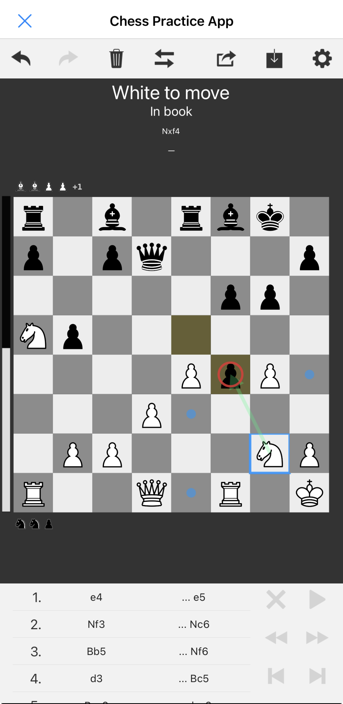

# Chess Practice App



## High-Level Overview

This app is a chess training and play environment with a strong focus on opening practice that blends:

- free play vs AI (local lightweight engine)
- structured opening training (guided, corrective)
- optional cloud guidance (Lichess cloud eval) + local book hints
- human-oriented learning (ideas, traps, punishments)

The core goal is not just to memorize moves, but to build understanding of:
- opening ideas
- typical structures
- tactical motifs
- common beginner mistakes and how they are punished

---

## Architectural Mental Model

### Centralization + Separation of Responsibilities

The code is organized around a single source of truth for chess rules, practice enforcement, and UI-facing state.

**Game logic (`ChessGame`)**
- Owns the authoritative `chess.Board`
- Owns opening selection, practice model compilation, and expected-move enforcement
- Owns theory/book lookup helpers
- Owns move application methods (human/AI), undo/redo stacks, import/export
- Produces HUD strings (row 1–4)

**Scene orchestration (`ChessScene`)**
- Owns rendering objects (board, HUD, promotion overlay, evaluation bar)
- Owns background work lifecycle:
  - AI move worker
  - local engine evaluation
  - cloud eval scheduling
- Owns state transitions after position changes (refresh overlays, clear selection, queue work)
- Calls into `ChessGame` for all chess and training decisions

**UIKit / views (`game_view.py`)**
- Owns top bar and modal sheets (settings, import/export)
- Treats the scene as the interactive game surface
- Reads only public state via scene/game methods

**Rendering (`chess_ui.py`)**
- Owns geometry and drawing (squares, pieces, legal marks, suggestion arrows, evaluation bar)
- Contains no chess or training logic

---

## Current Feature Set

### Play & Interaction
- Tap-to-select and tap-to-move
- Legal move dots and capture rings
- Board flip (play from White or Black perspective)
- Undo, redo, and reset
- Import PGN or FEN; export PGN or FEN

### Move Navigation
- Move list / notation panel
- Clickable navigation to any move
- Step backward and forward through moves
- Jump directly to the start or end of the game

### Promotion
- Underpromotion chooser (Q/R/B/N) shown only when required
- Move is committed only after selecting a promotion piece

### AI (Local engine)
- Local AI opponent powered by a local lightweight alpha-beta pruning + iterative deepening engine
- Adjustable difficulty levels (1–5)
- AI can play either side

### Evaluation
- Vertical evaluation bar indicating side advantage
- Evaluation updates as positions change and reflects board orientation

### Captured Material
- Captured material display using micro piece icons above and below the board

### Opening Book + “Theory”
- Polyglot book support for non-practice play
- In-theory vs out-of-book detection
- Weighted randomness for book move selection
- Polyglot opening books are user-supplied and not included in the repository. Place `.bin` files in `assets/polyglot/` to enable local book support.

### Cloud Guidance (Lichess)
- Optional Lichess cloud evaluation
- Multi-PV display in the HUD
- Suggestion arrows driven by:
  - cloud PVs (when enabled and available)
  - local book moves (fallback)

### Suggestion Arrows
- Up to two arrows rendered with relative weighting
- Arrow colors encode the source (cloud, book, engine)
- Centralized suggestion generation in `ChessGame.compute_suggest_moves()`

---

## Opening Practice System

### Practice Mode Concept

When an opening is selected, the game enters practice mode, which provides:

- guidance from move 0 (including the first move)
- structured opening lines
- controlled branching
- instructional notes explaining why moves are played

Practice is opening-specific and tiered (e.g. beginner vs master).

### Practice Data Model

Openings are defined using a line-based model rather than a hand-authored move tree.

Each opening contains:
- a human-readable title
- one or more tiers
- each tier is a list of training items

Each training item contains:
- a unique ID
- tags (solid, trap, punishment, etc.)
- a full SAN move sequence
- per-move instructional notes

Lines are compiled at runtime into a position-key → expected-moves map.

### Practice Phases

The game tracks a conceptual practice phase:

- FREE — no opening selected
- READY — opening selected, guidance available
- IN THEORY — past practice model but still in book
- OUT OF THEORY — no known continuation

The phase influences:
- whether guidance is shown
- whether cloud evaluation is requested
- what the HUD displays

### Intended Training Behavior

**Correct Move**
- The move is applied
- Training continues without feedback

**Incorrect Move**
- Unexpected (but legal) moves covered by the practice model are blocked
- A short feedback note is latched in the HUD
- The board remains unchanged, allowing immediate retry

---

## Current State

- Opening practice infrastructure is in place
- Practice lines compile correctly
- Expected moves are detected per position
- Instructional notes are stored and displayed per move
- Practice enforcement blocks incorrect moves when applicable
- AI integrates with practice openings (forced replies when required)
- Cloud eval and local book suggestions feed the HUD and arrows
- Import/export and the standard play loop are stable

---

## Current Gaps

### Opening Trainers
- Opening content is still under active authoring
- Coverage depth varies by opening and tier
- Some punishment lines require further validation

---

## Future Ideas

### User-Owned Enhancements
- Board editor
- Time controls
- AI personality
- Persistent settings stored locally

### Additional Chess App Features
- Analysis mode for exploring variations without affecting the main game
- Post-game summary (opening reached, theory exit point, major mistakes)
- Move quality labels (inaccuracy, mistake, blunder)
- Per-opening progress tracking
- Board color themes and highlight customization
- Multiple piece sets
- Optional sound effects and haptic feedback
- Local save/load of games and sessions
- Annotated PGN export with instructional comments
- Quick copy/paste of FEN and PGN
- Automatic board flip based on side to move
- Non-clocked time tracking per side
- Optional threat or attacked-piece highlighting

---

## Module Map

### app.py
- Application entry point
- Creates and presents the main UI view

### game_view.py
- Top-level UIKit UI (toolbar + modal sheets)
- Settings sheet (AI options, opening selection, tier, arrows, cloud)
- Import/export sheets
- Enables and disables toolbar actions based on state

### chess_scene.py
- Gameplay orchestrator
- Constructs `ChessGame`, engines, and renderers
- Owns AI and evaluation scheduling
- Handles promotion flow and position-change transitions

### chess_game.py
- Core chess and training logic
- Board state, practice enforcement, book helpers
- Undo/redo, reset, import/export
- Centralized HUD text generation

### chess_ui.py
- Rendering and drawing primitives
- Board layout, piece sprites, overlays
- Suggestion arrows and evaluation bar
- Promotion overlay UI

### local_engine.py
- Local AI engine implementation
- Search, evaluation, and difficulty scaling

### lichess_engine.py
- Lichess cloud evaluation integration
- Multi-PV result handling
- Lightweight caching to avoid repeated requests

### opening_book.py
- Polyglot opening book helper
- Cached book lookups for fast theory checks

### openings.py
- Opening library and practice definitions
- Tiered SAN lines with instructional notes

---

## Installation (Pythonista / iOS)

This app is designed to run in **Pythonista 3 on iOS**.

Because Pythonista does not support standard `pip` installs in the same way as desktop Python, one dependency must be installed manually.

### Dependency: `python-chess`

The app depends on the open-source `python-chess` library.

#### Install steps

1. Download the source code from the official repository:  
   https://github.com/niklasf/python-chess

2. From the downloaded archive, copy **only** the `chess/` folder.

3. In Pythonista, navigate to:  
   **`site-packages (user)`**

4. Paste the `chess/` folder directly into `site-packages (user)`.

You should end up with a structure like:

```
site-packages (user)/
└── chess/
    ├── __init__.py
    ├── board.py
    ├── pgn.py
    └── ...
```

Once installed, the following should work in Pythonista:

```python
import chess
```

No other third-party Python packages are required.

---

### Optional Assets

#### Polyglot Opening Books

The app supports Polyglot `.bin` opening book files.

- Place any `.bin` files into:
  ```
  assets/polyglot/
  ```
- If no book files are present, the app will still run normally; opening-book features will simply be disabled.

---

### Running the App

1. Copy this repository into one of your Pythonista Scripts Libraries, in its own folder, e.g. `/pythonista_chess`.
2. Open and run `app.py`.

The app is optimized for interactive use on iOS and does not require additional setup.

---

## Licensing & Credits

### Source Code
All source code in this repository is licensed under the MIT License. See `LICENSE`.

### Assets
Chess piece sprites are derived from the Cburnett SVG chess set and are licensed under
Creative Commons Attribution-ShareAlike 3.0 (CC BY-SA 3.0). See `CREDITS.md` for details.
